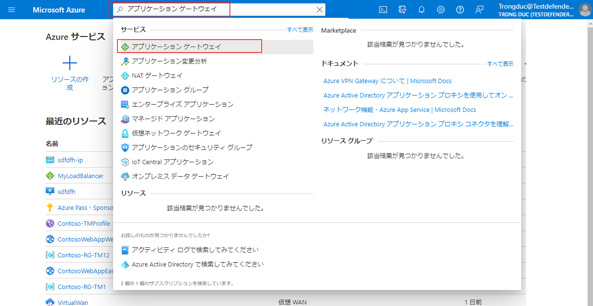
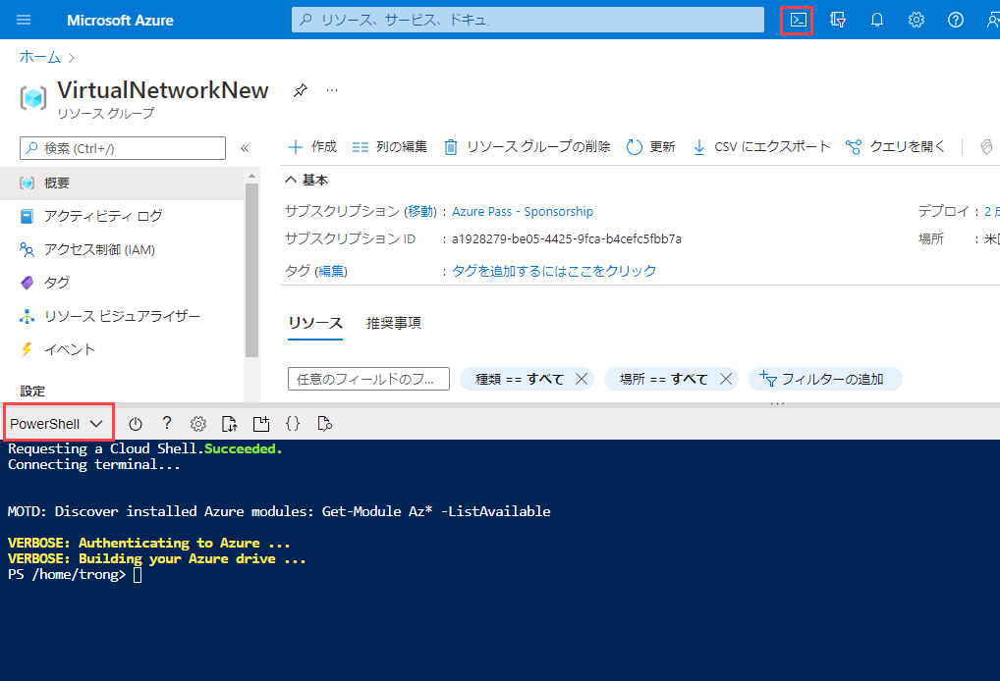
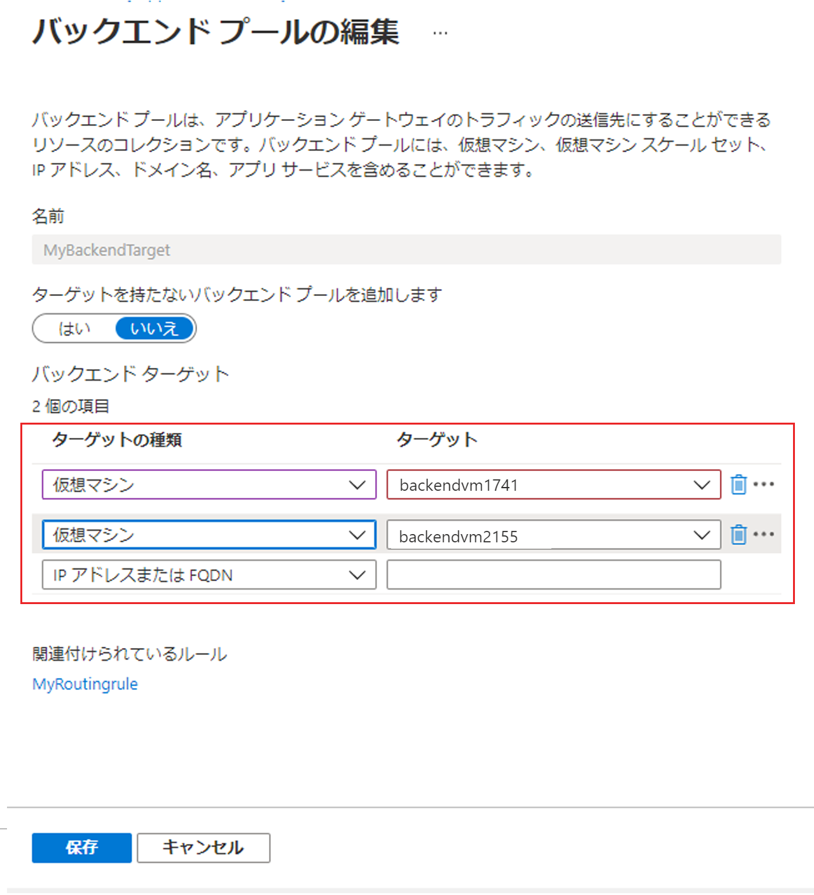
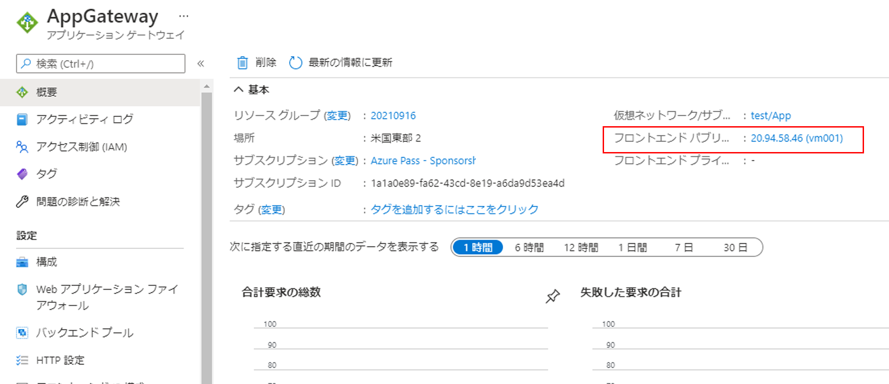

---
Exercise:
    title: 'M05-ユニット 4 Azure Application Gateway をデプロイする'
    module: 'モジュール - Azure で HTTP(S) トラフィックの負荷を分散する'
---

# M05-ユニット 4 Azure Application Gateway をデプロイする
 

この演習では、Azure portal を使用してアプリケーション ゲートウェイを作成します。さらに、それをテストし、正しく動作することを確認します。

アプリケーション ゲートウェイは、アプリケーション Web トラフィックをバックエンド プール内の特定のリソースに転送します。リスナーをポートに割り当て、ルールを作成し、リソースをバックエンド プールに追加します。わかりやすくするために、この記事では、パブリック フロントエンド IP、アプリケーション ゲートウェイで単一サイトをホストするための基本リスナー、基本要求ルーティング規則、およびバックエンド プール内の 2 つの仮想マシンを使用する簡単な設定を使用します。

ユーザーが作成したリソース間で Azure が通信を行うには、仮想ネットワークが必要です。新しい仮想ネットワークを作成するか、既存の仮想ネットワークを使用できます。この例では、アプリケーション ゲートウェイを作成するときに、新しい仮想ネットワークを作成します。Application Gateway インスタンスは、専用サブネットに作成されます。この例では、Application Gateway 用とバックエンドサーバー用の 2 つのサブネットを作成します。

この演習では、次のことを行います。

+ タスク 1: アプリケーション ゲートウェイを作成する
+ タスク 2: バックエンド ターゲットの追加
+ タスク 3: バックエンド プールヘのバックエンド サーバーの追加
+ タスク 4: アプリケーション ゲートウェイをテストする


## タスク 1: アプリケーション ゲートウェイを作成する

1. Azure アカウントを使用して [Azure portal](https://portal.azure.com/) にサインインします。

2. Azure portal ページの「**リソース、サービス、ドキュメントの検索 (G+/)**」で、アプリケーションゲートウェイと入力し、結果から「**アプリケーションゲートウェイ**」を選択します。
        

3. 「アプリケーションゲートウェイ」ページで、「**+ 作成**」を選択します。

4. 「アプリケーションゲートウェイの作成の**基本**」タブで、次の情報を入力または選択します。

   | **設定**         | **値**                                    |
   | ------------------- | -------------------------------------------- |
   | サブスクリプション        | サブスクリプションを選択します。                    |
   | リソース グループ      | 「新しい ContosoResourceGroup　の作成」を選択する       |
   | Application Gateway | ContosoAppGateway                            |
   | リージョン              | 「**米国西部**」を選択する                           |
   | 仮想ネットワーク     | **Create new**をクリックする                        |

5. 「仮想ネットワークの作成」で、次の情報を入力または選択します。

   | **設定**       | **値**                          |
   | ----------------- | ---------------------------------- |
   | 名前              | ContosoVNet                        |
   | **アドレス空間** |                                    |
   | アドレス範囲     | 10.0.0.0/16                        |
   | **サブネット**       |                                    |
   | サブネット名       | 「**既定**」を「**AGSubnet**」に変更する |
   | アドレス範囲     | 10.0.0.0/24                        |
   | サブネット名       | BackendSubnet                      |
   | アドレス範囲     | 10.0.1.0/24                        |

6. 「**OK**」を選択して、「アプリケーションゲートウェイの作成の基本」タブに戻ります。

7. 他の設定は既定値をそのまま使用し、「**次へ: フロントエンド**」を選択します。

8. 「**フロントエンド**」タブで、「**フロントエンド IP アドレスの種類**」が「**パブリック**」に設定されていることを確認します。

9. 「**パブリック IP アドレス**」に「**新規追加**」を選択し、パブリック IP アドレス名に AGPublicIPAddress と入力して、「**OK**」を選択します。

10. 「**次へ: バックエンド**」を選択します。

11. 「**バックエンド**」タブで「**バックエンド プールの追加**」を選択します。

12. 「**バックエンド プールの追加**」ウィンドウが開いたら、次の値を入力して空のバックエンド プールを作成します。

    | **設定**                      | **値**   |
    | -------------------------------- | ----------- |
    | 名前                             | BackendPool |
    | ターゲットを使用せずにバックエンド プールを追加する | はい         |

13. 「**バックエンド プールを追加する**」ウィンドウで、「**追加**」を選択しバックエンド プール構成を保存し、「**バックエンド**」タブに戻ります。

14. 「**バックエンド**」タブで、「**次へ: 構成**」を選択します。

15. 「**構成**」タブで、ルーティング規則を使用して作成したフロントエンド プールとバックエンド プールを接続します。

16. 「**ルーティング規則**」列で、「**ルーティング規則の追加**」を選択します。

17. 「**ルール名**」ボックスに、「**RoutingRule**」と入力します。

18. 「**リスナー**」タブで、次の情報を入力または選択します。

    | **設定**   | **値**         |
    | ------------- | ----------------- |
    | リスナー名 | リスナー          |
    | フロントエンド IP   | 「**パブリック**」を選択する |

19. 「**リスナー**」タブの他の設定の既定値を受け入れます。

    

20. 「**バックエンド ターゲット**」タブを選択して、残りのルーティング規則を構成します。

21. 「**バックエンド ターゲット**」タブで、次の情報を入力または選択します。

    | **設定**   | **値**      |
    | ------------- | -------------- |
    | ターゲット タイプ   | バックエンド プール   |
    | HTTP 設定 | **新規作成** |

22. 「**HTTP 設定の追加**」で、次の情報を入力または選択します。

    | **設定**        | **値**   |
    | ------------------ | ----------- |
    | HTTP 設定名 | HTTPSetting |
    | バックエンド ポート       | 80          |

23. 「**HTTP 設定を追加する**」ウィンドウの他の設定に既定値を受け入れてから、「**追加**」を選択して、「**ルーティング規則を追加する**」に戻ります。

24. 「**追加**」を選択して、ルーティング規則を追加し、「**構成**」タブに戻ります。

25. 「**次へ: タグ**」を選択してから、「**次へ：Review + create**」を選択します。

26. 「**Review + create**」タブの設定を確認する

27. 「**作成**」を選択して、仮想ネットワーク、パブリック IP アドレス、アプリケーション ゲートウェイを作成します。 

Azure が Application Gateway を作成するのに数分かかる場合があります。次のセクションに進む前に、デプロイが正常に完了するまで待機します。

## タスク 2: バックエンド ターゲットの追加

この例では、ターゲットのバックエンドとして仮想マシンを使用します。アプリケーション ゲートウェイのバックエンド サーバーとして 2 つの仮想マシンを作成します。

これを行うには、次を実行します。

- バックエンド サーバーとして使用される 2 つの新しい VM (BackendVM1 と BackendVM2) を作成します。

- IIS を仮想マシンにインストールして、アプリケーション ゲートウェイが正常に作成されたことを確認します。

- バックエンド サーバーをバックエンド プールに追加します。

### 仮想マシンを作成する

1. Azure portal ページの「**リソース、サービス、ドキュメントの検索 (G+/)**」で、仮想マシンと入力し、結果から「**仮想マシン**」を選択します。 

2. 「仮想マシン」ページで、**「+ 作成」** > **「+ 仮想マシン」**を選択します。

3. 「**仮想マシンの作成**」で、次の情報を入力または選択します (設定が一覧表示されていない場合は、既定値を使用します)。

   | **設定**          | **値**                                        |
   | -------------------- | ------------------------------------------------ |
   | 「**基本**」タブ       |                                                  |
   | サブスクリプション         | サブスクリプションを選択します。                        |
   | リソース グループ       | ContosoResourceGroup を選択する                      |
   | 仮想マシン名 | BackendVM1                                       |
   | イメージ                | 「**Windows Server 2016 Datacenter - Gen1**」を選択する |
   | ユーザー名             | TestUser                                         |
   | パスワード             | TestPa$$w0rd                                     |
   | パブリック受信ポート | なし                                             |
   | **ネットワーキング**       |                                                  |
   | 仮想ネットワーク      | ContosoVnet                                      |
   | サブネット               | BackendSubnet (10.0.1.0/24)                      |
   | **管理**       |                                                  |
   | ブート診断     | 無効化                                          |

4. 他の既定値をそのまま使用し、「**Review + create**」を選択します。

5. 「**Review + create**」 タブで、設定を確認し、検証エラーを修正してから、「**作成**」を選択します。

仮想マシンの作成が完了するのを待って先に進みます。

### テスト用の IIS のインストール

この例では、Azure がアプリケーション ゲートウェイを正常に作成したことを確認するために、仮想マシンに IIS をインストールします。

1. Azure PowerShell を開きます。

2. Azure portal の上部のナビゲーション バーで「**Cloud Shell**」を選択して、ドロップダウン リストで「**PowerShell**」を選択します。

   

3. 次のコマンドを実行して、IIS を仮想マシンにインストールします。必要に応じて、Location パラメーターを変更します。

```Azure PowerShell
Set-AzVMExtension `

 -ResourceGroupName ContosoResourceGroup `

 -ExtensionName IIS `

 -VMName BackendVM1 `

 -Publisher Microsoft.Compute `

 -ExtensionType CustomScriptExtension `

 - TypeHandlerVersion 1.4 `

 -SettingString '{"commandToExecute":"powershell Add-WindowsFeature Web-Server; powershell Add-Content -Path \"C:\\inetpub\\wwwroot\\Default.htm\" -Value $($env:computername)"}' `

 -Location WestUS
```

4. 2 番目の仮想マシンを作成し、「仮想マシンの作成と IIS のインストール」を使用して　IIS　をインストールし、以前に完了した手順をテストします。仮想マシン名および **Set-AzVMExtension** コマンドレットの **VMName** 設定には BackendVM2 を使用します。 

## タスク 3: バックエンド プールヘのバックエンド サーバーの追加

1. Azure portal メニューで「**すべてのリソース**」を選択するか、または「すべてのリソース」を検索して選択します。次に、「**ContosoAppGateway**」を選択します。

2. 「**設定**」で、「**バックエンド プール**」を選択します。

3. 「**BackendPool**」を選択します。

4. 「バックエンド プールの編集」ページの「**バックエンド ターゲット**」の「**ターゲットの種類**」で、「**仮想マシン**」を選択します。

5. 「**ターゲット**」で、「**BackendVM1**」を選択します。 

6. 「**ターゲットの種類**」で、「**仮想マシン**」を選択します。

7. 「**ターゲット**」で、「**BackendVM2**」を選択します。 

   

8. 「**保存**」を選択します。

デプロイが完了するまで待ってから次の手順に進んでください。

## タスク 4: アプリケーション ゲートウェイをテストする

IIS はアプリケーション ゲートウェイを作成するのに必要ではありませんが、この演習では、Azure によってアプリケーション ゲートウェイが正常に作成されたかどうかを確認するためにインストールしました。

### IIS を使用してアプリケーション ゲートウェイをテストします。

1. 「**概要**」ページで、アプリケーション ゲートウェイのパブリック IP アドレスを見つけます。 

   

2. パブリック IP アドレスをコピーし、お使いのブラウザーのアドレス バーに貼り付けて、その IP アドレスを開きます。

3. 応答を確認します。有効な応答によって、アプリケーション ゲートウェイが正常に作成されたことが確認され、それによりバックエンドに正常に接続できます。

   

4. ブラウザーを何度か更新すると、BackendVM1 と BackendVM2 の両方への接続が表示されます。

お疲れさまでした! Azure Application Gateway を構成およびテストしました。
